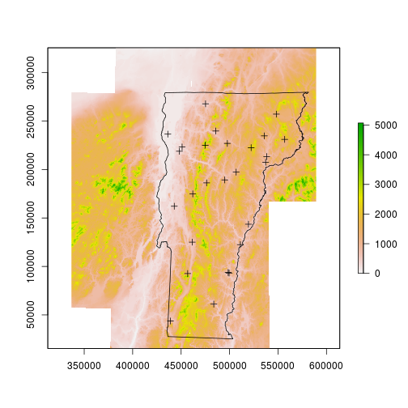
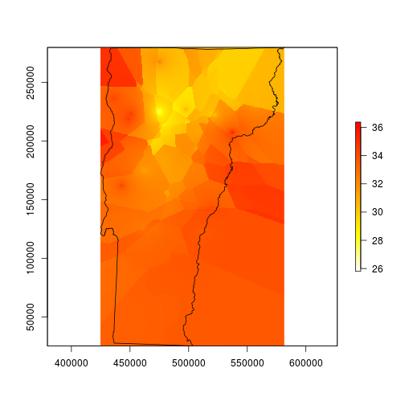
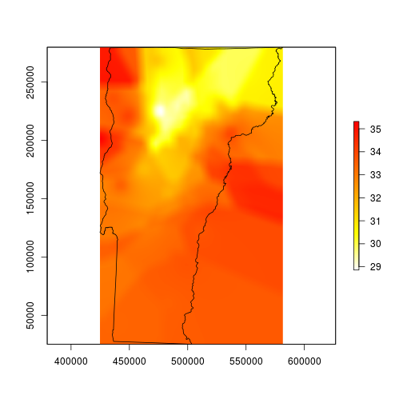
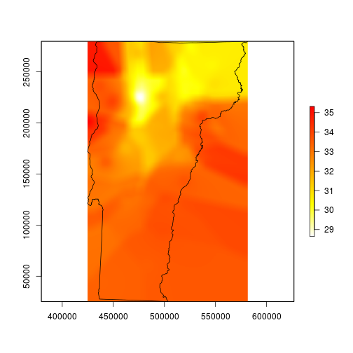
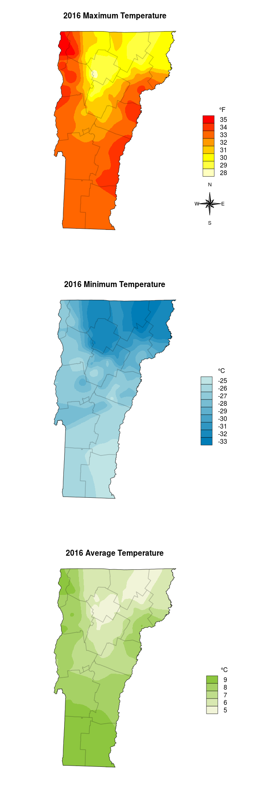



I was recently asked to put together a quick local weather summary for 2016. Temperature was a contributing component to the weather that year, so I'm planning to say a few words about it. The tricky thing is that I have temperatures recorded at about 25 weather stations in Vermont, and if I want to present that visually I'll need to either present the data in a table or fill in the space between the points -- interpolate between them.  

Interpolation can be done using linear modeling and a handful of spatial covariates, or it can be done using the inverse distance method. Us wildlife guys are used spatial interpolation using the MacKenzie-Royle occupancy model structure (see package unmarked), but I think for this I'm going to go straight inverse distance, no complex models or spatial covariates.  

The steps I'll complete here will be:
  1 Read in the three tables of temperatures(Min, Max, and Mean) and the station coordinates.  
  2 Merge the four tables by station name.  
  3 Convert the x-y table to a 'shapefile', or more generically, a sp::SpatialPointsDataFrame object.  
  4 Read in a raster to use for interpolation dimensions.  
  5 Read in a polygon file for boundary and extent dimensions. Transform datum to match the raster.  
  6 Interpolate!  
  7 Plot (with base graphics).   
  

I'm getting the data from the NRCC website (http://climod2.nrcc.cornell.edu/). This website doesn't support html queries, so you'll need to get your data manually. I grabbed Max, Min, and Average temperatures in three downloads.  

Step one is load the standard spatial data packages. In addition I'm also going to source in a few of my favorite helper scripts; one that makes a north arrow and another that allows me to customize filled boxes in the legend.   


```r
library(sp)
library(rgdal)
library(raster)
library(gstat)
source('mapFunctions.R') # Adapted from from http://www.jstatsoft.org/v19/c01/paper
source('http://www.math.mcmaster.ca/bolker/R/misc/legendx.R')
```

Next I'll read in the three tables, combine them by weather station name, and convert all of the Farenheit values to Celsius.  


```r
options(stringsAsFactors=FALSE)
ma <- read.csv('data/max.csv')
mi <- read.csv('data/min.csv')
me <- read.csv('data/mean.csv')

dat <- merge(ma[1:2], mi[1:2], by='Name', all=TRUE, sort=FALSE)
dat <- merge(dat, me[1:2], by='Name', all=TRUE, sort=FALSE)
names(dat) <- c('Name', 'Max', 'Min', 'Mean')
for(i in 2:4) dat[i] <- (as.numeric(dat[,i])-32) * 5/9
```

```
## Warning: NAs introduced by coercion

## Warning: NAs introduced by coercion

## Warning: NAs introduced by coercion
```

I forgot that I also grabbed the locations separately -- but also from the NRCC page. I clicked on the 'Multi-Station' tab, then chose 'Daily Data' and set 'State' to Vermont. I think I manually removed the actual data from this table and left just the station coordinates and elevation, which must be converted to numeric because the 'Burlington Area' row contains text rather than location data.  


```r
locations <- read.csv('data/locations.csv')
dat <- merge(locations, dat, by='Name', all=TRUE, sort=FALSE)
dat <- na.omit(dat)
# remove 'burlington area'
dat <- dat[-10,]
rownames(dat) <- 1:nrow(dat)
for(i in 2:3) dat[i] <- as.numeric(dat[,i])
```

When I get spatial points that don't specify the datum I typically assume they are WGS83. They might be NAD84, but the difference between the two is about 2 meters (on average), so I won't worry about it here.  


```r
spdat <- sp::SpatialPointsDataFrame(
    coords=dat[,c('Longitude','Latitude')], 
    data=dat[,c('Name','Elevation','Max','Min','Mean')], 
    proj4string = CRS("+init=epsg:4326")
)
```

Next I'll read in a raster (any raster; I happen to be using the local 1 degree DEM), and a few polyfon files. One is the Vermont border, the other contains counties.  


```r
dem <- raster::raster('data/dem_250/dem_250')
spdat <- sp::spTransform(spdat, CRS(proj4string(dem)))
vt <- rgdal::readOGR(dsn='data/VT', layer='VT_Boundaries__state_polygon')
```

```
## OGR data source with driver: ESRI Shapefile 
## Source: "data/VT", layer: "VT_Boundaries__state_polygon"
## with 1 features
## It has 3 fields
```

```r
vt <- sp::spTransform(vt, CRS(proj4string(dem)))
counties <- rgdal::readOGR(dsn='data/BoundaryCounty_CNTYBNDS', layer='Boundary_CNTYBNDS_poly')
```

```
## OGR data source with driver: ESRI Shapefile 
## Source: "data/BoundaryCounty_CNTYBNDS", layer: "Boundary_CNTYBNDS_poly"
## with 14 features
## It has 4 fields
```

```r
counties <- sp::spTransform(counties, CRS(proj4string(dem)))
plot(dem)
plot(vt, add=TRUE)
plot(spdat, add=TRUE)
```



I'll start by interpolating the max temperature data, then later I'll repeat for min and mean. I'm going to use the gstat package and specify the intercept model. The helpfile for interpolate suggests that I should be using lm since the lat and long are implicit (rather than explicit) components of the model, but that didn't work for me and this did.  


```r
fitmax <- gstat::gstat(formula = Max ~ 1, data = spdat, nmax = 4, set = list(idp = .5))
maxint <- raster::interpolate(dem, model=fitmax, ext=vt)
```

```
## [inverse distance weighted interpolation]
```

```r
plot(maxint, col=rev(heat.colors(255)), ext=vt)
plot(vt, add=TRUE)
```



I spent several minutes trying to figure out why my map looks like it was made by a cubist robot. I think it just needs to be smoothed for better contouring. I'm smoothing it here by using a moving window average function. The window here is about 1.26 miles wide and 1.78 miles tall.  


```r
# smooth with a local average that automatically removes NA values
fmean <- function(x) mean(x, na.rm=TRUE)
# pad allows the function to run all of the way to the edges
vtmaxsm <- raster::focal(maxint, w=matrix(1, 101, 101), fmean, pad=TRUE)
plot(vtmaxsm, col=rev(heat.colors(255)), ext=vt)
plot(vt, add=TRUE)
```



This looks much better, so I'll mask to the state boundary and go for the finishing touches.  


```r
# mask to state boundary
vtmaxsm_m <- raster::mask(vtmaxsm, vt)
```

```
## Warning in `[<-`(`*tmp*`, cnt, value = p@polygons[[i]]@Polygons[[j]]):
## implicit list embedding of S4 objects is deprecated
```

```r
plot(vtmaxsm_m, ext=vt)
plot(vt, add=TRUE)
```



Here is a part that is tough to automate: the legend. I look at the range of temperatures and decide I can just use steps of 1 degree.  


```r
# determine the range of temps
max_minval <- floor(cellStats(vtmaxsm_m, stat='min'))
max_maxval <- ceiling(cellStats(vtmaxsm_m, stat='max'))
max_temprange <- max_minval:max_maxval
maxcolgrad <- rev(heat.colors(length(max_temprange)))
```

And the final plot I add the boundaries one at a time so I can better control the border color.  


```r
plot(vtmaxsm_m, ext=vt, col=maxcolgrad, axes=FALSE, box=FALSE, legend=FALSE, main='2016 Maximum Temperature')
for(i in 1:nrow(counties)) plot(counties[i,], border=rgb(0,0,0,alpha=0.12), lwd=2, add=TRUE)
plot(vt, add=TRUE)
legend('bottomright', legend=rev(max_temprange), fill=rev(maxcolgrad), bty='n', title=expression(paste("\t   ", degree,"C")),  box.cex=c(2, 1), inset=c(0, .25))
# I set the legend location with a call to locator()
northarrowTanimura(loc=c(599037.5, 58730), size=60000, cex=0.8)
```


Then I repeat for the min and mean temperatures, and I can plot them all on the same image.  


```r
## MIN
fitmin <- gstat(formula = Min ~ 1, data = spdat, nmax = 4, set = list(idp = .5))
minint <- interpolate(dem, model=fitmin, ext=vt)
```

```
## [inverse distance weighted interpolation]
```

```r
# smooth with a local average
vtminsm <- focal(minint, w=matrix(1, 101, 101), fmean, pad=TRUE)
# mask to state boundary
vtminsm_m <- mask(vtminsm, vt)
```

```
## Warning in `[<-`(`*tmp*`, cnt, value = p@polygons[[i]]@Polygons[[j]]):
## implicit list embedding of S4 objects is deprecated
```

```r
# determine the range of temps
min_minval <- floor(cellStats(vtminsm_m, stat='min'))
min_maxval <- ceiling(cellStats(vtminsm_m, stat='max'))
min_temprange <- min_minval:min_maxval
coolramp <- colorRampPalette(c('#007db7', '#bfe4e5'))
mincolgrad <- coolramp(length(min_temprange))

## MEAN
fitmean <- gstat(formula = Mean ~ 1, data = spdat, nmax = 4, set = list(idp = .5))
meanint <- interpolate(dem, model=fitmean, ext=vt)
```

```
## [inverse distance weighted interpolation]
```

```r
# smooth with a local average
vtmeansm <- focal(meanint, w=matrix(1, 101, 101), fmean, pad=TRUE)
# mask to state boundary
vtmeansm_m <- mask(vtmeansm, vt)
```

```
## Warning in `[<-`(`*tmp*`, cnt, value = p@polygons[[i]]@Polygons[[j]]):
## implicit list embedding of S4 objects is deprecated
```

```r
# determine the range of temps
mean_minval <- floor(cellStats(vtmeansm_m, stat='min'))
mean_maxval <- ceiling(cellStats(vtmeansm_m, stat='max'))
mean_temprange <- mean_minval:mean_maxval
meanramp <- colorRampPalette(c('#f1f4d8', '#8dc63f'))#008080
meancolgrad <- meanramp(length(mean_temprange))


par(mfrow=c(3,1))
par(mar=c(5.1,0,4.1,0))
plot(vtmaxsm_m, ext=vt, col=maxcolgrad, axes=FALSE, box=FALSE, legend=FALSE, main='2016 Maximum Temperature')
for(i in 1:nrow(counties)) plot(counties[i,], border=rgb(0,0,0,alpha=0.12), lwd=2, add=TRUE)
plot(vt, add=TRUE)
legend('bottomright', legend=rev(max_temprange), fill=rev(maxcolgrad), bty='n', title=expression(paste("\t   ", degree,"F")),  box.cex=c(2, 1), inset=c(0, .25)) 
northarrowTanimura(loc=c(611923.3, 59500), size=60000, cex=0.8)


par(mar=c(5.1,0,4.1,0))
plot(vtminsm_m, ext=vt, col=mincolgrad, axes=FALSE, box=FALSE, legend=FALSE, main='2016 Minimum Temperature')
for(i in 1:nrow(counties)) plot(counties[i,], border=rgb(0,0,0,alpha=0.12), lwd=2, add=TRUE)
plot(vt, add=TRUE)
legend('bottomright', legend=rev(min_temprange), fill=rev(mincolgrad), bty='n', title=expression(paste("\t   ", degree, "C")), box.cex=c(2, 1), inset=c(0, .25)) 

par(mar=c(5.1,0,4.1,0))
plot(vtmeansm_m, ext=vt, col=meancolgrad, axes=FALSE, box=FALSE, legend=FALSE, main='2016 Average Temperature')
for(i in 1:nrow(counties)) plot(counties[i,], border=rgb(0,0,0,alpha=0.12), lwd=2, add=TRUE)
plot(vt, add=TRUE)
legend('bottomright', legend=rev(mean_temprange), fill=rev(meancolgrad), bty='n', title=expression(paste("\t   ", degree, "C")), box.cex=c(2, 1), inset=c(0, .25)) 
```




