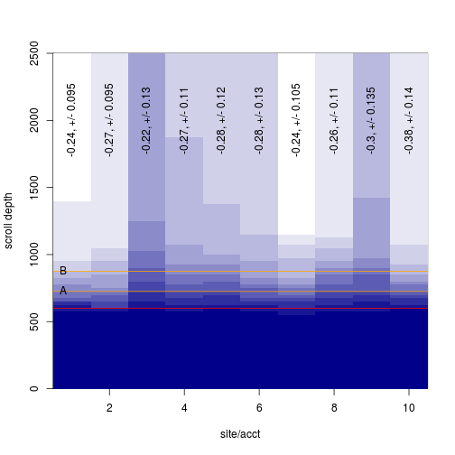

2018-08-17  

The task was to compute the change in proportion of visitors who will see an element in its current location vs a proposed location.  

Yesterday I suggested a gamma distribution to compute probabilities, but it is easier to use the  data as an empirical distribution rather than attempt to back-fit the data to a set of shape parameters.  

I can use the gamma to simulate one group of scroll data for each of 10 accounts:  


```r
scroller <- function(n=50) round(rgamma(n, runif(1, 2, 2.25), runif(1, 3.25, 3.5)) * 500) + 500
hScroll <- function(scrolls) hist(scrolls, breaks=seq(0, 2500, by=25), plot=FALSE)

tenaccts <- replicate(10, scroller(round(runif(1, 50, 85))), simplify=FALSE)
htenaccts <- lapply(tenaccts, hScroll)
htenaccts.mat <- do.call(rbind, lapply(htenaccts, function(x) cumsum(x$counts)))
# Also a blue color palette
blues <- colorRampPalette(colors=c('darkblue', 'white'))
```

In the image below, the 'fold' is a red line, the line at 'A' is the location or an element now, the line at 'B' is the proposed location.  


```r
element <- c(A=725, B=875)

makeplot <- function() {
    image(x=1:10, y=htenaccts[[1]]$mids, z=htenaccts.mat, col=blues(12), ylab='scroll depth', xlab='site/acct')
    abline(h=600, col='red')

    abline(h=element, col='orange')
    text(x=0.5, y=element, labels=c('A', 'B'), pos=4)
}
makeplot()
```


With sufficient N we can use each data set as its own empirical distribution to see how the number of viewers will change when the element is moved:  


```r
viewPct <- function(scrolls, px) {
    pct <- round(unlist(lapply(px, function(x) sum(scrolls >= x) / length(scrolls))), 2)
    c(pct, difference=unname(pct[2]-pct[1]))
}

# Per account, the difference is:
viewdiff <- sapply(tenaccts, function(x) viewPct(x, element))
viewdiff
```

```
##             [,1]  [,2]  [,3]  [,4]  [,5]  [,6]  [,7]  [,8]  [,9] [,10]
## A           0.47  0.49  0.63  0.61  0.61  0.53  0.54  0.68  0.61  0.60
## B           0.23  0.22  0.41  0.34  0.33  0.25  0.30  0.42  0.31  0.22
## difference -0.24 -0.27 -0.22 -0.27 -0.28 -0.28 -0.24 -0.26 -0.30 -0.38
```

We can resample each account get a variance:  

```r
resamp <- function(x, n) {
    newscrolls <- replicate(n, sample(x, length(x), replace=TRUE), simplify=FALSE)
    newviews <- do.call(rbind, lapply(newscrolls, viewPct, px=element))
    setNames(range(newviews[,3]), c('upper', 'lower'))
}

viewerr <- sapply(tenaccts, resamp, n=60)

viewdiff.err <- rbind(difference=viewdiff[3,], '+/-'=apply(viewerr, 2, function(x) (x[2]-x[1])/2))

makeplot()
text(1:10, y=2000, labels=paste0(viewdiff.err[1,], ', +/- ', viewdiff.err[2,]), srt=90)
```



```r
viewdiff.err
```

```
##              [,1]   [,2]  [,3]  [,4]  [,5]  [,6]   [,7]  [,8]   [,9] [,10]
## difference -0.240 -0.270 -0.22 -0.27 -0.28 -0.28 -0.240 -0.26 -0.300 -0.38
## +/-         0.095  0.095  0.13  0.11  0.12  0.13  0.105  0.11  0.135  0.14
```

If we are ok to treat each site as a replicate we can compute the range without resampling.  


```r
paste0('difference:', mean(viewdiff[3,]), ', +/-', (range(viewdiff[3,])[2]-range(viewdiff[3,])[1])/2)
```

```
## [1] "difference:-0.274, +/-0.08"
```


